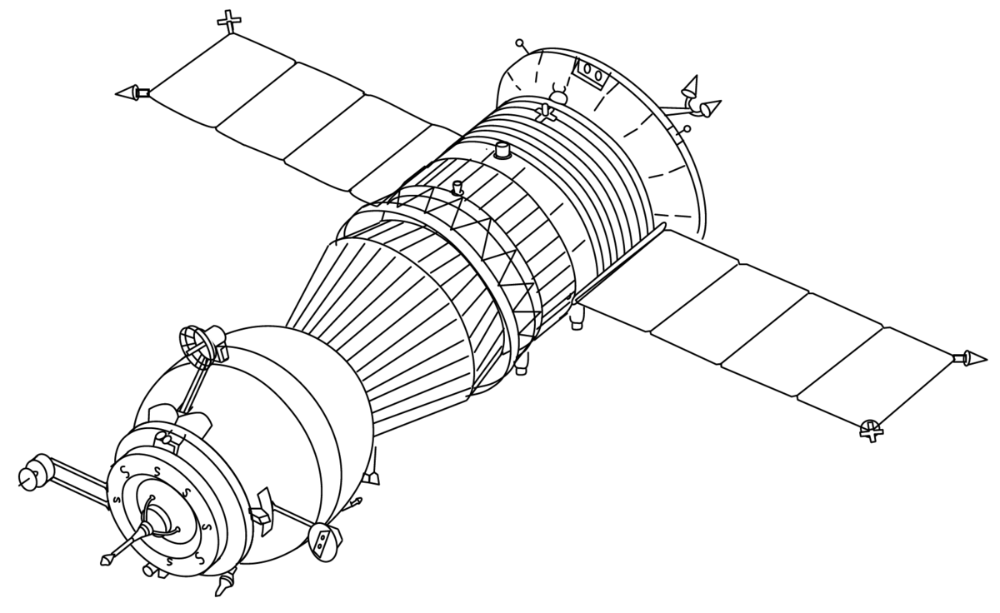

# :robot:  The Mars Exploration Program

> "[...] the question of whether Machines Can Think [...] is about as relevant as the question of whether Submarines Can Swim."
> 
> Edsger Dijkstra,  *The Threats to Computing Science*

<div  align="center">

  

</div>

<br>

## :space_invader: Regras do Desafio

Um conjunto de sondas foi enviado pela NASA a um planalto retangular do planeta Marte. Este planalto deve ser explorado pelas sondas para que suas câmeras embutidas consigam registrar uma visão completa da área demarcada e enviar as imagens de volta para a Terra. Para controlar as sondas, a NASA envia uma sequência de letras dentre as possíveis: L, R, M e P. Destas, L e R fazem a sonda virar 90 graus para a esquerda ou direita, respectivamente, sem mover a sonda. A letra M faz com que a sonda mova-se um ponto da malha para frente, mantendo a mesma direção. A letra P aciona a câmera para fotografar a planície exatamente na posição em que a sonda está apontada. Foi solicitado, então, a construção de um programa para processar a série de informações de comando que as sondas recebem da NASA para a exploração de Marte.

### Entrada dos dados

- A entrada de dados poderia ser por Interface de Linha de Comando (CLI) ou por arquivo.
- A primeira linha da entrada de dados seria a coordenada do ponto superior-direito da malha do planalto.
- O resto da entrada seriam as informações das sondas que foram implantadas. Cada sonda seria representada por duas linhas, sendo a primeira indicando sua posição inicial e a segunda uma série de instruções indicando como a sonda deveria explorar o planalto.
  
#### Exemplo:
5 5
1 2 N
LMLMLMLMMPP
3 3 E
MMRMMRPRRM

### Saída dos dados

- A saída de dados poderia ser por CLI ou por arquivo.
- Deveria conter uma linha para cada sonda, na mesma ordem de entrada, representando sua localização final e direção. 

#### Exemplo:
1 3 N
5 1 E

A aplicação deveria ser feita com a linguagem de programação de preferência do candidato e sem a utilização de frameworks. Testes e validações foram permitidos. Para a realização desta aplicação, a linguagem escolhida foi JavaScript, bem como o framework de testes Jest para a realização dos testes unitários.

## :alien: O Desafio

  Na primeira versão da aplicação, o formato de entrada de dados escolhida foi através da Interface de Linhas de Comando (CLI)

## :boom: Tecnologias utilizadas
  
* JavaScript

* Node.js

* Jest 

## :cat: Getting Started

Para rodar essa aplicação em sua máquina, você precisa ter uma IDE e o Node.js instalados. Com ambos instalados e preparados, em seu terminal, execute:

  

```shell

npm install

```

Após a instalação das dependências, para rodar a aplicação e observar a saída final do arquivo na pasta "outputs", execute o seguinte comando:

  

```shell

node .

```

  

Para a execução dos testes, execute:

  

```shell

jest

```

  

Pronto! Você conseguiu rodar a aplicação.
 

## :fire: Task list

-  [x] Pegar os dados inseridos por arquivo

-  [x] Limitar o planalto retangular com o valor do superior direito

-  [x] Apontar a sonda para uma direção

-  [x] Andar com a sonda para a direção apontada

-  [x] Tirar foto na coordenada e direção apontada

-  [x] Inserir os dados de saída no arquivo

####  Adicionais

-  [x] Implementação de testes unitários
